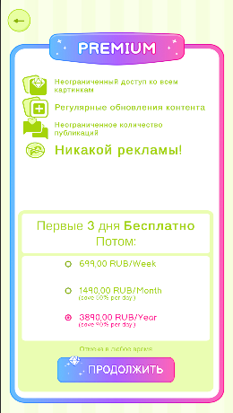
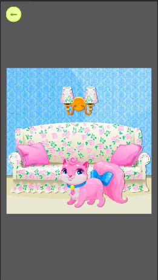

# Menu Screen with Online Gallery
Мини-приложение: экран меню игры с баннерной каруселью, табами и онлайн-галереей изображений.
Проект реализован в рамках тестового задания на позицию **Unity Developer**.

---

## 🧩 Что реализовано

### 📌 Экран меню
- Адаптивный UI, сверстанный по макету из Figma
- Поддержка портретной ориентации
- Корректная работа на телефонах и планшетах

### 🖼️ Баннерная карусель
- 3 баннера в верхней части экрана
- Автопрокрутка каждые **5 секунд**
- Переключение свайпом
- Плавный snap к ближайшему баннеру
- Индикатор текущего слайда (dots)

### 🗂️ Таб-бар
Три вкладки под шапкой:
- **All** — все изображения
- **Odd** — только изображения с нечётными ID (1, 3, 5, …)
- **Even** — только изображения с чётными ID (2, 4, 6, …)

✔ Переключение вкладок работает  
✔ Контент галереи обновляется согласно выбранному фильтру

### 🖼️ Галерея изображений
- Онлайн-загрузка изображений
- Загрузка **только видимых элементов** (lazy load)
- Не загружаются все изображения сразу
- Сетка:
    - 📱 Телефоны — **2 колонки**
    - 📲 Планшеты — **3 колонки**
- Адаптация сетки при изменении разрешения
- Переиспользование элементов через **object pool**

### 💎 Premium-логика
- **Каждое 4-е изображение** помечено бейджем `Premium`
- Premium определяется **по глобальному ID**, а не по позиции в списке
- Бейдж не меняет позицию при переключении вкладок

### 🪟 Попапы
- Обычное изображение → попап с увеличенным просмотром
- Premium-изображение → попап покупки Premium
- Все попапы:
    - Блокируют ввод в фоне
    - Корректно закрываются
    - Кнопки кликабельны (без бизнес-логики)

---

## ⚙️ Используемые технологии и подходы
- **Unity 2022.3 LTS**
- **TextMeshPro**
- **ScriptableObject** — конфигурация экрана
- **Object Pooling** — элементы галереи
- **Lazy Loading** — подгрузка изображений по мере скролла
- **Coroutine-based async**
- **Input blocking** через overlay Image
- Архитектура без `Manager`-классов и god-objects

---

## 📸 Скриншоты

**All tab**

**Even tab**

**Premium popup**

**Image popup**
